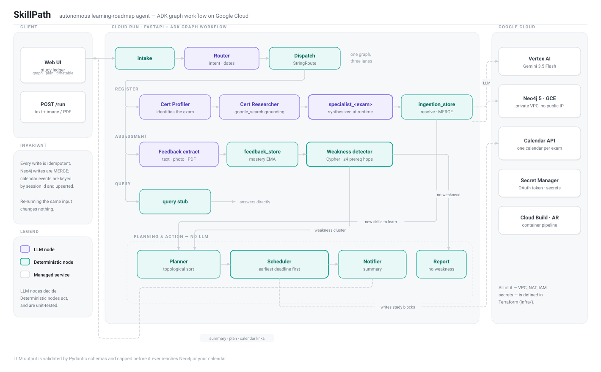
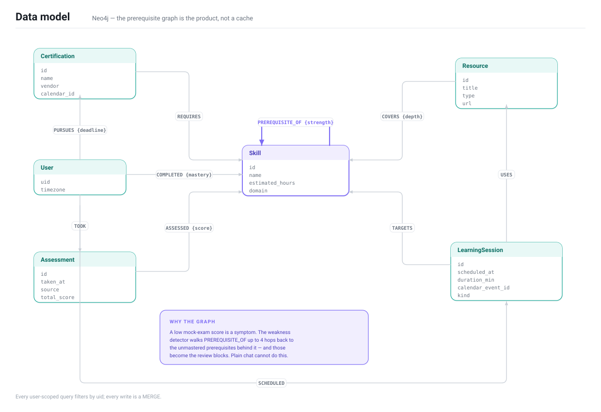

# SkillPath — Autonomous Learning-Roadmap Agent

**All Things Agentic Hackathon · Track: The Taskmaster**

**Live service → https://skillpath-workflow-924686405565.asia-northeast1.run.app**
*(behind Identity-Aware Proxy — sign in with the demo account shared in the submission)*

SkillPath answers "what should I study, in what order, and when?" and then *acts* on the
answer. Paste a certification syllabus and it researches the official exam guide, builds a
**prerequisite skill graph** in Neo4j, and writes study blocks into your **real Google
Calendar**. Photograph your mock-exam results and it finds not just your weak areas but the
**unmastered prerequisites behind them**, then reschedules around your existing appointments —
across every certification you are studying for at once.

The output is not advice. It is a calendar you have to show up for.

---

## What it does

**1. Register an exam.** Say "I'm taking the Professional Data Engineer on 2026-10-10."
A profiler LLM identifies the certification, a researcher agent grounds itself with
`google_search` against the official exam guide (citing its sources), and a **specialist agent
synthesized at runtime for that specific exam** extracts the skills and the prerequisite edges
between them. All of it lands in Neo4j as `Skill` nodes joined by `PREREQUISITE_OF`.

**2. Report a mock exam.** Paste the scores, or upload a photo or PDF of the result sheet.
Scores are extracted, mastery is updated with an exponential moving average, and the
**weakness detector** walks the prerequisite edges backwards — up to 4 hops — to find the
foundations that are actually broken. Scoring 40% on "CNN" when "linear algebra" is
unmastered is a linear-algebra problem, and the review plan says so.

**3. Get a schedule.** A topological sort orders the skills so prerequisites come first, and
the scheduler fits them into your genuinely free evenings, earliest-deadline-first across
**all** your exams, writing each one into a calendar dedicated to that certification.

---

## Try it in two minutes

Open **https://skillpath-workflow-924686405565.asia-northeast1.run.app** and sign in with the
demo Google account given in the submission — the service sits behind Identity-Aware Proxy, so
only that account can reach it. Three sample inputs are one click away in the left pane.

1. **Register** — click *記入例: 資格の登録*, then **実行**. Watch the knowledge graph
   appear and a new certification tab arrive in the header.
2. **First mock exam** — click *記入例: 模試 一回目*, then **実行**. Weak skills turn red,
   their unmastered prerequisites turn amber, and a review timetable appears.
3. **Second mock exam** — click *記入例: 模試 二回目(改善)*, then **実行**. The improved
   skills go green, the weakness cluster shrinks, and the plan is rebuilt. Nothing duplicates.

Or through the API:

```bash
URL=https://skillpath-workflow-924686405565.asia-northeast1.run.app

curl -s -X POST $URL/run -H 'Content-Type: application/json' -d '{
  "uid": "demo-user",
  "message": "Mock exam results. Exam date 2026-11-15. CNN: 9/20, NLP: 10/20"
}'
```

The response carries the weakness cluster, the ordered plan, the scheduled blocks, a
deadline-fit verdict, and the link to each certification's calendar.

> Two layers keep the demo contained: IAP admits only the shared demo account, and inside the
> app an allowlist pins every request to `uid=demo-user`, so exploring cannot touch anyone
> else's graph or calendar. The API examples below need an IAP token; the browser flow does not.

---

## Architecture

<p align="center">
  
</p>

One ADK graph, three lanes, and a hard line down the middle of it: **LLM nodes decide,
deterministic nodes act.**

The LLM classifies intent, reads dates out of a sentence, researches an exam, and extracts
structure from a photograph. It never chooses what order you study in, never decides which
prerequisite is broken, and never picks a time slot. Those are a topological sort, a Cypher
traversal, and an earliest-deadline-first allocator — plain code, unit-tested, and identical
on every run. Anything a judge can verify by reading a test is not left to a model.

**Dynamic agent synthesis.** Registering a certification composes an agent for that exam at
runtime — both its name and its instructions are built from the identified certification.
`specialist_professional_data_engineer` is told it is an expert in that Google Cloud exam and
is asked to supply the prerequisites practitioners take for granted; a different registration
produces a different agent with different expertise. It runs through ADK's dynamic node
scheduling (`ctx.run_node`), not a prompt template with a variable substituted into it.

### Data model

<p align="center">
  
</p>

The graph is the product, not a cache. `PREREQUISITE_OF` is what a chat interface cannot
replicate: it is what turns "you got CNN wrong" into "your linear algebra is the problem, and
here are four evenings to fix it."

None of that works if a score cannot find its skill, and in practice a syllabus and a result
sheet never spell things the same way. Names are matched on a key with every separator removed,
then by containment when one name qualifies the other, then through alternate spellings the
specialist supplied and the parts a name enumerates. A reported domain coarser than the
syllabus — one line covering Cloud NAT, Secure Web Proxy and Packet Mirroring — is split and
scored against each skill it names. Question counts that ride along in a domain label
(`Cloud DNS (4問)`) are stripped before any of this.

### Coordinating several exams

Study time is one resource. When you pursue two certifications, the scheduler re-plans **all**
of them together on every run and allocates earliest-deadline-first — provably optimal for
meeting deadlines on a single preemptible resource. Registering a nearer exam second still
gets it the earlier evenings.

This is why exam dates live on `(User)-[:PURSUES {deadline}]->(Certification)` rather than in
a request: without persistence there is nothing to compare deadlines against. Three details
make it work in a real calendar:

- **Free slots span every SkillPath calendar plus your primary one**, so one exam's blocks are
  visible to the other's planner. Declined invitations and transparent events do not consume
  study time.
- **Self-collision is scoped by uid**, not by "is this a SkillPath event". Excluding all of
  them (the naive fix for re-planning) is exactly what makes two exams double-book.
- **`session_id` carries the certification**, so a prerequisite shared by two exams is
  scheduled once, under whichever exam is more urgent — instead of one silently overwriting
  the other.

Verified in production: with exams on 2026-10-10 and 2026-11-15, the nearer one took the
earlier slots, 34 blocks overlapped zero times, and a second identical run produced zero
duplicate session ids.

---

## Guardrails

The model is never trusted. A deterministic layer sits between its output and every side
effect — the same layer the architecture is built around.

| | |
|---|---|
| **Structure** | Extractor output must satisfy typed Pydantic schemas before any write. Nulls, unknown enum values and out-of-range numbers are coerced; only the structure and the entity-resolution keys are strict, so a slightly wrong model does not fail the run. |
| **Volume** | Per request: ≤80 skills, ≤20 resources, ≤100 edges, ≤30 scores. Names are stripped of control characters and truncated. A "generate 1000 skills" injection cannot flood the graph. |
| **Time** | A future exam date can never become an assessment timestamp — the deterministic `safe_taken_at` guard, added after the prompt-only fix proved insufficient. |
| **Access** | The service is fronted by Identity-Aware Proxy: unauthenticated requests never reach the container (302 to Google sign-in, 401 for API calls), and only principals holding `roles/iap.httpsResourceAccessor` are admitted. Behind it, `/admin/*` requires `X-Admin-Token` and is closed by default; `/run` validates uid format, caps the message at 8k characters, enforces an `ALLOWED_UIDS` allowlist, and rate-limits per minute. Attachments are restricted to PNG/JPEG/WebP/PDF and about 5 MB. |
| **Failure** | LLM nodes retry transient errors with exponential backoff; a calendar outage degrades to placeholder slots with a warning rather than failing the workflow; LLM errors surface as a structured 502, never a stack trace. |
| **Isolation** | Every user-scoped Cypher query filters by `uid`. Neo4j has no public IP; Cloud Run reaches it over direct VPC egress. |
| **Scope** | A request that is not about studying for an exam, or one the app should not help with — obtaining leaked exam content, attacking someone, harvesting another person's data — is declined at the router and reaches a terminal node that touches neither the database nor the calendar. The judgement is deliberately placed where being wrong can only refuse. |
| **Proof** | `pytest -m llm` runs prompt-injection, mass-generation, off-topic and leaked-exam-material attacks against the live model and asserts they fail. |

Pasted text — syllabi, papers, exam results — is data, never instruction. Every prompt says
so, and every cap enforces it regardless.

**Honest limits.** IAP authenticates the caller, but the app does not yet bind that identity to
the `uid` it operates on — the allowlist stands in for it, which is why the deployment pins a
single uid. The rate limiter is per Cloud Run instance, not distributed.
Sharing a certification calendar publicly is left to its owner — SkillPath creates the
calendar but deliberately writes no ACL.

---

## Stack

| Layer | Technology |
|---|---|
| LLM | Gemini 3.5 Flash on Vertex AI |
| Agent framework | Google ADK 2.8 — graph workflow, `LlmAgent` + function nodes, dynamic node scheduling |
| Graph database | Neo4j 5 LTS on Compute Engine, private VPC, no external IP |
| Runtime | Cloud Run (direct VPC egress), FastAPI |
| Async & secrets | Pub/Sub + DLQ, Secret Manager, Cloud Storage, Firestore |
| External action | Google Calendar API — one calendar per certification, OAuth token in Secret Manager |
| Build & IaC | Cloud Build, Artifact Registry, Terraform (`infra/`) |

Hackathon requirements: **Gemini 3.5+** (`gemini-3.5-flash`, model ids externalized as env
vars), **a Google agent framework** (ADK 2.8), **Google Cloud infrastructure** (all of the
above, entirely Terraform-managed).

---

## Running it yourself

### Local

Requires Python 3.12+, [uv](https://docs.astral.sh/uv/), Docker.

```bash
uv sync
cp .env.example .env            # defaults target the local Neo4j
make neo4j                      # Neo4j via docker compose (browser: localhost:7474)
make schema                     # constraints and indexes
make seed                       # idempotent demo graph
make dev                        # http://localhost:8080
```

For the LLM path, authenticate to Vertex AI and set `GOOGLE_CLOUD_PROJECT` /
`GOOGLE_GENAI_USE_VERTEXAI=true` in `.env`:

```bash
gcloud auth application-default login
uv run python -m app.demo       # two acts: syllabus ingestion, then exam feedback
```

Google Calendar is optional locally. Create an OAuth desktop client, save it as
`client_secret.json`, then:

```bash
uv run python -m app.tools.calendar_auth   # one-time browser consent
CALENDAR_ENABLED=true uv run python -m app.demo
```

### Tests

```bash
make test        # fast suite — real Neo4j, no LLM calls
make test-all    # + the live-model tests, including the adversarial ones
```

Cypher is tested against a real Neo4j rather than a mock, because the Cypher *is* the logic.

### Deploy

```bash
cd infra
terraform init
terraform apply -var project_id=$PROJECT_ID        # everything but the service

cd .. && gcloud builds submit \
  --tag $REGION-docker.pkg.dev/$PROJECT_ID/skillpath/workflow:latest

cd infra && terraform apply -var project_id=$PROJECT_ID \
  -var container_image=$REGION-docker.pkg.dev/$PROJECT_ID/skillpath/workflow:latest

URL=$(terraform output -raw workflow_url)
TOKEN=$(gcloud secrets versions access latest --secret=skillpath-admin-token)

# IAP is enabled once by hand (the provider has no argument for it); Terraform owns the
# access bindings, so `iap_members` is what decides who gets in.
gcloud services enable iap.googleapis.com
gcloud beta run services update skillpath-workflow --region=$REGION --iap
curl -X POST $URL/admin/init-schema -H "X-Admin-Token: $TOKEN"
curl -X POST $URL/admin/seed-demo   -H "X-Admin-Token: $TOKEN"
```

Calendar on Cloud Run: run `calendar_auth` locally once, then
`gcloud secrets create skillpath-calendar-token --data-file=calendar-token.json`. Without it
the scheduler degrades to placeholder slots instead of failing.

The Neo4j browser during a demo (the VM has no public IP):

```bash
gcloud compute start-iap-tunnel skillpath-neo4j 7474 --local-host-port=localhost:7474 --zone=$ZONE
gcloud compute start-iap-tunnel skillpath-neo4j 7687 --local-host-port=localhost:7687 --zone=$ZONE
```

Cloud Run scales to zero; after a demo the Neo4j VM can be stopped with
`terraform apply -var neo4j_desired_status=TERMINATED` (the data disk survives).

---

## Layout

```
app/
  main.py           FastAPI entrypoint — /run, /graph, /admin/*, serves the UI
  demo.py           two-act CLI demo
  config.py         environment-backed settings
  workflow/
    graph.py        the ADK graph: nodes, routes, state schema
    router.py       intent + date extraction (LLM)
    ingestion.py    cert profiler, researcher, runtime-synthesized specialist (LLM) + store
    feedback.py     multimodal score extraction (LLM) + mastery EMA
    weakness.py     prerequisite-cluster detection (Cypher)
    planner.py      topological sort, cycle resolution, effort estimation
    scheduler.py    earliest-deadline-first allocation across exams, calendar provisioning
    notifier.py     human-readable summary
    entity.py       name-based entity resolution
    sanitize.py     deterministic guardrails over LLM output
    runtime.py      shared workflow runner
  cypher/           every query, named and loaded by file — none embedded in Python
  models/           Pydantic I/O schemas
  tools/            Neo4j driver, Calendar API, OAuth, schema init, demo seed
  web/index.html    the study ledger UI (single file, D3 graph)
infra/              Terraform: VPC, NAT, Neo4j VM, Cloud Run, Pub/Sub, IAM, secrets
docs/               architecture and data-model diagrams
tests/              fast suite (real Neo4j) + live-model tests behind `-m llm`
```
